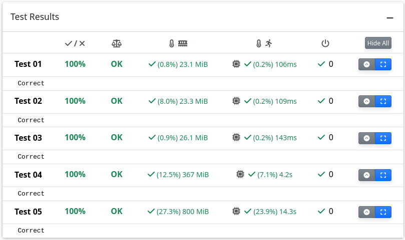

The 3-partition problem is to decide whether a given multiset of integers can be partitioned into triplets that all have the same sum.
For simplicity, we consider a special case where given integers are positive and pair-wise different.
The partitioning means that every given integer is exactly in one triplet.
This decision problem is strongly NP-complete and more information can be found on [Wikipedia](https://en.wikipedia.org/wiki/3-partition_problem).

In this exercise, all tested instances have a solution, and your task is to write a program which returns one.
Implement function solve_3partition in the file partition_sat.py and upload only this file to ReCodex.

This task can be solved using many methods (e.g. CSP, Linear Programming and backtracking), but the goal of this assignment is to practice using SAT solvers on a simple problem. 
Therefore, you are expected to use the library **python-sat** (https://pypi.org/project/python-sat/).

Your program must work in general, although it is tested only on given tests.
This means that your program must find a correct solution of every instance of the problem assuming the program has enough time and memory.
Your program will be evaluated by the number of tests it passed in a given time limit.

Beware that a simply greedy algorithm which takes triplets of expected sums one by one does not work in general.
For example, consider integers 5, 6, 7, 9, 10, 11, 13, 14, 15.
The expected sum of every triplet is 30.
If the greedy algorithm starts by a triplet 6, 10, 14, then the remaining integers cannot be partitioned.
However, the instance has a solution [7, 10, 13], [5, 11, 14], [6, 9, 15].

Observe that there are at most $4.5 n^2$ triplets having expected sum for given $3n$ distinct integers.
Usually, the number of triplets having expected sum is significantly smaller than this theoretical upper bound, so all of them can be stored in memory.

Hints:
* Read the [documentation](https://pysathq.github.io/) to learn how the use the SAT solver.

