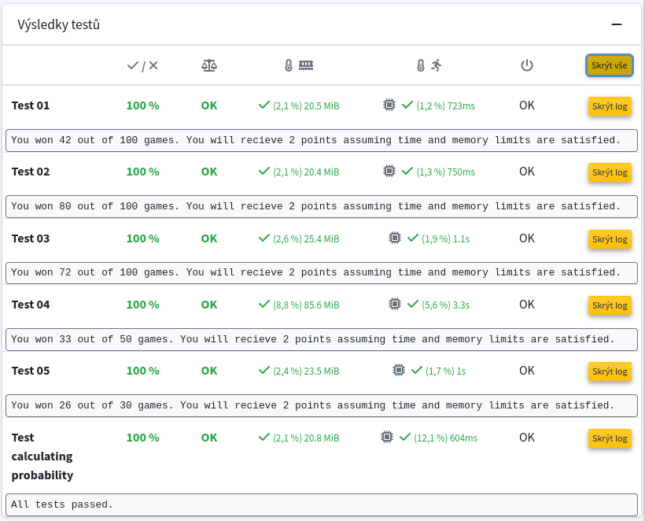

Your objective is to develop an AI player for the well-known game of [Minesweeper](https://en.wikipedia.org/wiki/Minesweeper_(video_game)). If you are unfamiliar with the game, you can familiarize yourself with it [here](https://minesweeperonline.com/).

The file `minesweeper_player.py` currently contains a basic player implementation, and your task is to enhance it. Please note that it is not possible to win every game. You are permitted to modify this file as needed, but you must maintain the interface used by the `minesweeper_test.py` file. Only the `minesweeper_player.py` file should be submitted.

You are encouraged to utilize and integrate all relevant knowledge from our course, including informed search, logic, and probabilistic reasoning. In particular, Constraint Satisfaction Problems (CSP) or Satisfiability (SAT) solvers may prove beneficial. However, you are expected to clearly explain your approach, so please include comments in your code. Inadequate documentation may result in a reduction of points.

The file `probability_test.py` contains tests designed to verify the accuracy of the probability calculations for mines in each cell. These tests are evaluated at zero points on Recodex, making their successful completion voluntary. Nevertheless, they may assist you in completing this assignment.

All examples provided in `probability_test.py` and their corresponding solutions are correct. If your calculations yield different results, please review the definition of [conditional probability](https://en.wikipedia.org/wiki/Conditional_probability) carefully.

Please be aware that there is a time limit of one minute for each test on Recodex.

