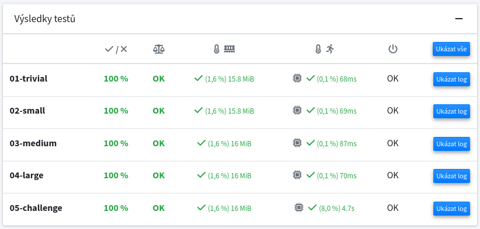

**Game Rules**

The game commences with n stones, each numbered from 1 to n. Players alternate turns to remove one of the remaining numbered stones. During each turn, specific restrictions dictate which stones are eligible for removal. The restrictions are as follows:

* In the initial move, the first player may select any stone.
* In subsequent moves, players alternate turns. The stone number that a player may remove must either be a multiple or a factor of the stone number removed in the previous turn (notably, 1 is a factor of all other numbers). Additionally, the selected stone must not have been previously removed. Once a stone is taken, its number becomes the new reference for the last move. A player loses the game if they are unable to select a valid stone.

An illustrative example of the game is provided below for n = 7:
* Player 1: 3
* Player 2: 6
* Player 1: 2
* Player 2: 4
* Player 1: 1
* Player 2: 7
* Winner: Player 2

**Task**

Implement the function *player* in the file *multiple_divisor.py*. This function is designed to execute a single move for a player. The function accepts two arguments:
* `stones`: A list of remaining numbers that have not yet been removed.
* `last`: A number representing the stone removed in the last move.

The function is expected to return a number that can be taken to secure a win if the current position is winning; otherwise, it should return *False* if the position is loosing.

To simplify the task, the function is not required to make the first move, thus the last move is always provided. Please submit only the file *multiple_divisor.py*, which must not be renamed.

As with all assignments, it is prohibited to store any precomputed information in the submitted file, particularly solutions for given tests.

**Hints**

* Since every game state is either winning or losing, it is unnecessary to compute alpha-beta values within the minimax algorithm.
* Given that both players adhere to the same rules, a single recursive function suffices for both players.
* To demonstrate that a move is winning, it is essential to verify that all potential actions available to the opponent result in losing outcomes.
  Consequently, it is often more efficient to prioritize moves for which the opponent has fewer possible responses.
* Analyzing states that are close to terminal conditions may also reduce the depth of the search tree.

